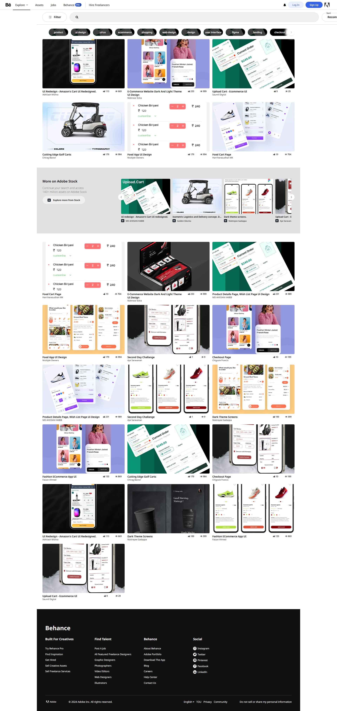

# Behance Landing Page - Frontend Copy  

**Live Demo:** [Behance Landing Page](https://short-zed.github.io/Behance-landing-page/)   

A responsive frontend clone of Behance's landing page, built using modern HTML, CSS, and JavaScript. This project focuses on replicating Behance's visually appealing design and user-friendly interface while maintaining clean, efficient, and responsive code.

 

---

## Features  

- **Responsive Design**: Optimized for all screen sizes, including mobile, tablet, and desktop devices.  
- **Pixel-Perfect Layout**: Faithfully replicates the original Behance landing page design.  
- **Smooth Animations**: Includes subtle hover effects and animations for an interactive user experience.  
- **Cross-Browser Compatibility**: Ensures the page looks great across all major browsers.  
- **Optimized Performance**: Code structured for quick load times and minimal resource usage.  

---

## Tech Stack  

- **HTML5**: For the semantic structure of the page.  
- **CSS3**: Used for styling, grid layout, and responsive design techniques.  
- **JavaScript (ES6)**: For interactivity and dynamic behavior.  

---

## Preview  

### Live Link  
Click here to preview the project: [Behance Landing Page](https://short-zed.github.io/Behance-landing-page/)  

---

## Installation  

1. Clone the repository:  
   ```bash
   git clone https://github.com/short-zed/behance-landing-page.git
